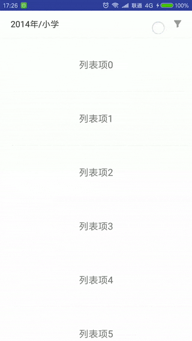

这是新项目中用到的一个过滤器控件，会根据输入数据动态生成过滤器视图。每组过滤条件为单选，当选择的过滤条件有变化时会通过回调方法通知用户，并更新标题栏上的条件显示。

### 效果




### 样式设置

控件仅提供了几个简单的样式设置项，如文字颜色、背景颜色、按钮背景选择器等，通过相应的set方法来进行设置：

```java
setAnimateDuration(long animateDuration)：设置动画持续时间，ms
setTitleBackgroundColor(int color)：设置标题栏背景色
setTitleTextColor(int color)：设置标题栏文字颜色
setContentBackgroundColor(int color)：设置展开部分的背景色
setButtonBackgroundDrawableResource(int drawableResource)：设置确定按钮的背景
setButtonTextColor(int color)：设置确定按钮的文字颜色
setGroupTitleTextColor(int color)：设置分组标题的文字颜色
setConditionTextColorResource(int colorResource)：设置过滤条件单选框的文字颜色
setConditionBackgroudDrawableResource(int drawableResource)：设置过滤条件单选框的背景
```

如果有更复杂的需求，建议直接修改控件源码。

### 使用示例

见项目代码。